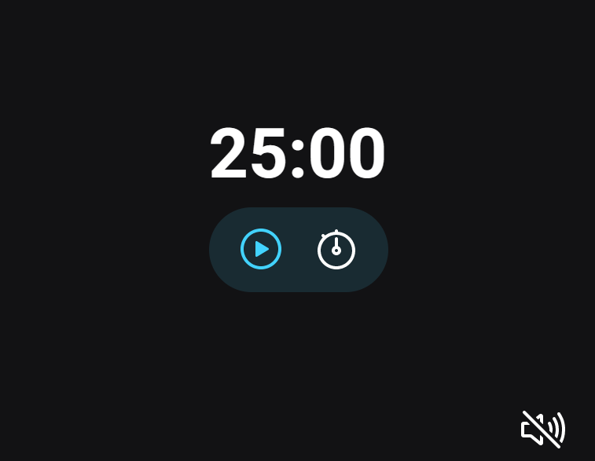
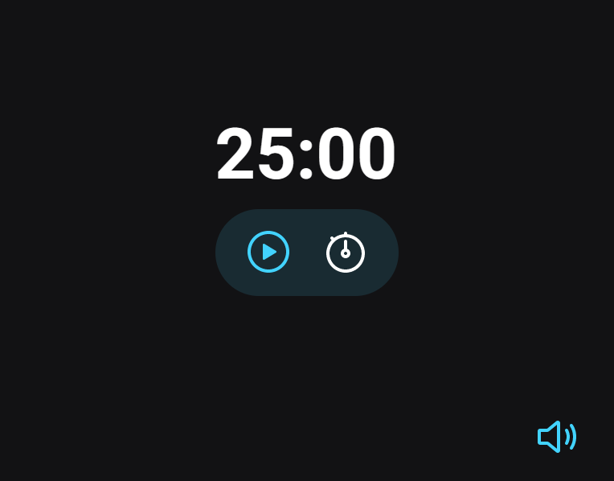

#  ⏰ Focus Timer - Pomodoro 🍎

This is a project for a Pomodoro-style timer.

 Button functionalities:
-  Play: Start the timer
- Pause: the timer
- Stop: Stop the timer
- Set: Set the minutes for the timer
- Icon sound on: Play a music
- Icon sound off: Mute the music
 
 You can check the layout here 🔗[Layout](https://www.figma.com/file/TxspFT5B1TNSTWtDFSc97X/Explorer-Stage-05-Projeto-01-(Copy)?node-id=0%3A1&t=9Bx2yZ11XruFnZbH-0)

## 🛠️ Technology

Project developed with these technologies:

- HTML e CSS
- Git e Github
- Javascript

## 🚀 Deploy

[Focus Timer](https://)

## 🔎 Preview

##   💻 Contact me

 
  

 Made by [**Amandatec**](https://www.linkedin.com/in/amanda-oliveira-20/">)